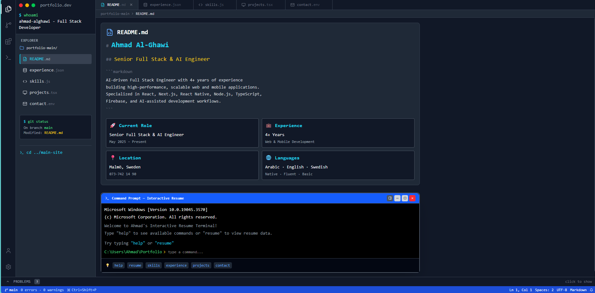
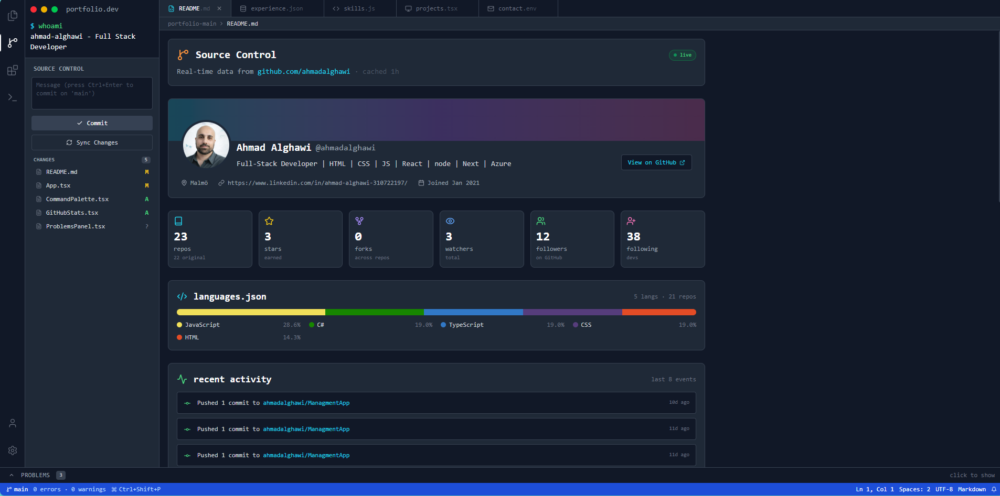

<div align="center">

# 💻 Portfolio 2026 — Developer Playground

### A VS Code–styled portfolio built with React, TypeScript & Tailwind CSS v4

[](https://react.dev)
[](https://www.typescriptlang.org)
[](https://vitejs.dev)
[](https://tailwindcss.com)
[](https://www.framer.com/motion)
[](https://opensource.org/licenses/MIT)
[](CONTRIBUTING.md)

**[Live Demo](https://ahmad-alghawi.dev)** · **[Report Bug](https://github.com/ahmadalghawi/portfolio2026/issues)** · **[Request Feature](https://github.com/ahmadalghawi/portfolio2026/issues)**

</div>

---

## 🎯 About

**Portfolio 2026** is an open-source developer portfolio that looks and behaves like **Visual Studio Code**. Every interaction — the activity bar, tabs, sidebar panels, command palette, terminal, and status bar — is modeled after the real IDE, so visiting your portfolio feels like opening a familiar code editor.

It's built to be **easily forked**: swap the data files, tweak the theme, and you have your own IDE-themed portfolio without touching component logic.

> **✨ Highlights** — Fully themeable · 5 built-in themes · Real GitHub API integration · Hacker-mode Konami easter egg · Command palette · Live terminal · Typing sounds · Zen & Compact modes · Firebase-backed CMS with admin panel

---

## 📸 Preview

<div align="center">

> _Add your own screenshots/GIFs here_

| Desktop (Dark+) | Source Control (live GitHub) | Hacker Mode (Konami) |
|:---:|:---:|:---:|
|  |  |  |

</div>

---

## ✨ Features

### 🖼️ VS Code-style shell
- **Activity Bar** with Explorer, Source Control, Extensions, Terminal
- **Sidebar panels** that swap content based on the active icon
- **Tabs, Status Bar, Problems Panel** — all themed
- **Zen Mode** hides chrome for distraction-free reading

### 🎨 Theme system
- **5 built-in themes** — Dark+, Light+, Monokai, Dracula, Solarized
- Font-size control, animation toggle, line numbers, compact mode
- All driven by CSS variables — easy to add your own theme

### 🐙 Real GitHub integration
- Full live profile dashboard in the **Source Control** view
- Profile header, stats grid, language breakdown with authentic GitHub colors
- Real **activity feed** (pushes, stars, forks, PRs, releases…)
- Sortable / searchable / filterable **repository list**
- Cached in `sessionStorage` to respect API rate limits

### ⌨️ Keyboard-first UX
- `Ctrl+Shift+P` — **Command Palette** with fuzzy search and navigation
- `Ctrl+,` — **Settings Modal**
- `Ctrl+B` — Toggle sidebar
- Full shortcut reference inside Settings

### 🔊 Interactive terminal
- Real typed commands — `help`, `about`, `skills`, `projects`, `experience`, `contact`, `now`, `clear`, `whoami`, `sudo hire-me`
- Minimizable, dockable (bottom/right), scanline CRT overlay
- Optional **mechanical keyboard typing sounds** via Web Audio API

### 🕹️ Easter eggs
- **Konami code** (`↑ ↑ ↓ ↓ ← → ← → B A`) triggers a cinematic 12-second hacker-mode animation with matrix rain, intrusion log, progress bars, and an "ACCESS GRANTED" reveal
- Secret command `matrix` in the terminal
- Hidden `sudo hire-me` response

### 📱 Responsive & accessible
- Mobile drawer for the sidebar
- Semantic HTML, ARIA labels, focus management
- Respects `prefers-reduced-motion` via the animations toggle

---

## 🛠️ Tech Stack

| Layer | Tool |
|---|---|
| **Framework** | React 19 + TypeScript |
| **Build Tool** | Vite 8 |
| **Routing** | react-router-dom 7 |
| **Styling** | Tailwind CSS v4 + CSS variables |
| **Animations** | Framer Motion 12 |
| **Icons** | lucide-react |
| **Text FX** | react-type-animation |
| **Audio** | Web Audio API (zero dependencies) |
| **State** | React Context + `localStorage` |
| **Backend** | Firebase (Firestore + Storage + Auth) |
| **Data** | GitHub public REST API + Firestore CMS |

---

## 🚀 Getting Started

### Prerequisites

- **Node.js 18+** and **npm** (or `pnpm` / `yarn`)

### Installation

```bash
# 1. Clone the repo
git clone https://github.com/ahmadalghawi/portfolio2026.git
cd portfolio2026

# 2. Install dependencies
npm install

# 3. Start the dev server
npm run dev
```

Open <http://localhost:5173> in your browser.

### Build for production

```bash
npm run build    # outputs to dist/
npm run preview  # preview the production build locally
```

---

## 🎨 Making It Yours (fork & customize)

Replacing the content is designed to take **under 10 minutes** — no component edits required.

### 1. Personal info & section content
All data lives in `src/data/`:

```
src/data/
├── projectsData.ts        → your projects (title, description, stack, links)
├── experienceData.ts      → work history
├── testimonialsData.ts    → recommendations
├── nowData.ts             → "what I'm doing now" items
└── terminalCommands.ts    → terminal responses (about/skills/contact/…)
```

### 2. GitHub username
Change the `USERNAME` constant in:

```ts
// src/components/GitHubProfile.tsx
const USERNAME = 'your-github-handle';
```

### 3. Contact info
Email, LinkedIn, GitHub, and resume links live in:
- `src/components/sections/Contact.tsx`
- `src/data/terminalCommands.ts`

### 4. Themes & colors
Tweak existing themes or add your own in `src/styles/themes.css` — every theme is just a block of CSS variables.

### 5. SEO / meta tags
Edit `index.html` → title, description, OG tags, favicon.

### 6. 🪪 The 3D Lanyard ID-card

The home page features a physics-driven 3D ID card on a lanyard (built with **Three.js** + **React Three Fiber** + **Rapier**). Two assets control its look:

```
src/assets/lanyard/
├── card.glb       ← the 3D ID-card model (geometry + texture)
└── lanyard.png    ← the fabric band texture
```

#### Change the card face (photo / name / logo)

1. Open the **online 3D editor** → <https://modelviewer.dev/editor/>
2. Drag your `card.glb` file into the editor window
3. In the right-hand panel, expand the `base` material
4. Click the **Base Color Texture** slot → upload your own image (1024×1024 PNG works well)
   - This is the "front" of the ID card — put your photo, name, title, logo, QR code, whatever
5. Click **Export** → **glTF (.glb)** → download
6. Replace `src/assets/lanyard/card.glb` with your new file
7. `npm run dev` — your card is now live

> **Tip** — design your card face in Figma/Photoshop as a rectangular image matching the card's aspect ratio (roughly **2:3 portrait**), then export as PNG before uploading.

#### Change the lanyard strap

Just open `src/assets/lanyard/lanyard.png` in any image editor and repaint — the texture tiles along the strap.

#### Tweak the physics / camera

All configurable in `@/src/components/Lanyard/Lanyard.tsx`:

```tsx
<Lanyard
  position={[0, 0, 20]}      // camera distance — lower = closer
  gravity={[0, -40, 0]}      // world gravity — make it float/sink
  fov={20}                   // field of view
  onCardClick={...}          // fires on a quick tap (not drag)
/>
```

> **Note** — the `card.glb` file needs to expose three named meshes (`card`, `clip`, `clamp`) and two materials (`base`, `metal`). If you model your own card from scratch, keep those names so `Lanyard.tsx` can find them.

---

## � Firebase CMS (optional backend)

The portfolio now includes a **fullstack headless CMS** powered by **Firebase**:

| Feature | Tech |
|---|---|
| **Database** | Firestore (collections: `projects`, `experience`, `testimonials`, `now`, `cv`, `messages`) |
| **Storage** | Firebase Storage (project cover images) |
| **Auth** | Firebase Auth (email/password, single-admin UID) |
| **Public cache** | SWR with `localStorage` + 1-hour TTL |
| **Admin panel** | `/admin` — CRUD for all collections + inbox + CV editor |

### Setup

1. Create a Firebase project → enable **Firestore**, **Storage**, and **Authentication** (Email/Password).
2. Copy `.env.example` → `.env` and fill in your Firebase web-app config.
3. Update `src/lib/firebase.ts` → set `ADMIN_UID` to your Firebase Auth user's UID.
4. Update `firestore.rules` and `storage.rules` → replace the hardcoded UID with yours, then deploy:
   ```bash
   npm install -g firebase-tools
   firebase login
   firebase deploy --only firestore:rules,storage
   ```
5. Seed initial data:
   ```bash
   npx tsx scripts/seed.ts
   ```

### Using the admin panel

1. Sign up a user in Firebase Authentication console.
2. Go to `/admin/login` and sign in.
3. Manage projects (with image upload), experience, testimonials, now items, CV content, and read contact-form messages.

> The public site uses **SWR caching** — edits propagate automatically after the TTL, or immediately on hard refresh.

---

## � Project Structure

```
portfolio2026/
├── doc/                       # architecture & roadmap docs
├── public/                    # static assets
├── scripts/
│   └── seed.ts               # seed Firestore from static data
├── firestore.rules           # Firestore security rules
├── storage.rules             # Firebase Storage rules
├── .env.example              # Firebase config template
├── src/
│   ├── main.tsx              # entry point (AuthProvider wrap)
│   ├── App.tsx               # layout shell, routes, admin escape
│   ├── assets/
│   │   └── lanyard/          # card.glb + lanyard.png for the 3D ID-card
│   ├── components/           # UI components
│   │   ├── ActivityBar.tsx
│   │   ├── Sidebar.tsx
│   │   ├── GitHubProfile.tsx # live GitHub dashboard
│   │   ├── CommandPalette.tsx
│   │   ├── SettingsModal.tsx
│   │   ├── HackerMode.tsx
│   │   ├── Lanyard/          # 3D draggable ID-card (Three.js + Rapier)
│   │   ├── sections/         # About, Skills, Projects, Experience, Contact
│   │   └── admin/            # admin UI primitives + toast
│   ├── pages/
│   │   ├── CV.tsx            # standalone /cv résumé page
│   │   └── admin/            # admin CRUD pages + login + layout
│   ├── contexts/
│   │   ├── AuthContext.tsx   # Firebase Auth provider
│   │   └── SettingsContext.tsx
│   ├── hooks/
│   │   ├── useSWR.ts         # generic stale-while-revalidate hook
│   │   ├── useAuth.ts        # auth context consumer
│   │   ├── useProjects.ts    # cached Firestore reads
│   │   ├── useExperience.ts
│   │   ├── useTestimonials.ts
│   │   ├── useNow.ts
│   │   ├── useCV.ts
│   │   ├── useKonami.ts
│   │   ├── useTypingSounds.ts
│   │   ├── useHotkeys.ts
│   │   └── useGitHubData.ts
│   ├── lib/
│   │   ├── firebase.ts       # SDK init + admin UID
│   │   ├── cache.ts          # SWR cache helper
│   │   ├── storage.ts        # Firebase Storage upload/delete
│   │   ├── types.ts          # shared domain types
│   │   └── repositories/     # Firestore CRUD per collection
│   │       ├── projects.ts
│   │       ├── experience.ts
│   │       ├── testimonials.ts
│   │       ├── now.ts
│   │       ├── cv.ts
│   │       └── messages.ts
│   ├── data/                 # static fallback content
│   └── styles/
│       └── themes.css        # CSS variable themes
└── package.json
```

📖 **For a full architecture deep-dive**, see [`doc/ARCHITECTURE.md`](./doc/ARCHITECTURE.md).

---

## 📜 Scripts

| Command | Description |
|---|---|
| `npm run dev` | Start Vite dev server with HMR |
| `npm run build` | Type-check and produce optimized production build |
| `npm run preview` | Preview the production build locally |
| `npm run lint` | Run ESLint across the project |

---

## 🌐 Deployment

This project is a static SPA — deploy it anywhere.

### Vercel (recommended)

```bash
npm i -g vercel
vercel
```

### Netlify

```bash
npm run build
npx netlify deploy --prod --dir=dist
```

### GitHub Pages

```bash
npm run build
# Push dist/ to gh-pages branch using your preferred action/workflow
```

### Docker

```dockerfile
FROM node:20-alpine AS build
WORKDIR /app
COPY package*.json ./
RUN npm ci
COPY . .
RUN npm run build

FROM nginx:alpine
COPY --from=build /app/dist /usr/share/nginx/html
```

---

## 🗺️ Roadmap

- [x] VS Code–style shell (ActivityBar · Sidebar · Tabs · StatusBar)
- [x] 5 built-in themes + custom settings panel
- [x] Command Palette with fuzzy search
- [x] Live GitHub profile dashboard
- [x] Konami-code hacker mode
- [x] Typing sounds via Web Audio
- [x] Firebase-backed CMS (Firestore + Storage + Auth + admin panel)
- [x] Contact form with messages inbox
- [ ] Blog panel with markdown posts
- [ ] AI "Ask me anything" chatbot
- [ ] i18n (English / Arabic / French)
- [ ] PWA / offline support

---

## 🤝 Contributing

Contributions, issues, and feature requests are welcome!

1. **Fork** the project
2. Create your feature branch (`git checkout -b feat/amazing-feature`)
3. Commit your changes (`git commit -m 'feat: add amazing feature'`)
4. Push to the branch (`git push origin feat/amazing-feature`)
5. Open a **Pull Request**

Please follow [Conventional Commits](https://www.conventionalcommits.org/) for commit messages.

Before submitting, run:

```bash
npm run lint
npx tsc --noEmit -p tsconfig.app.json
npm run build
```

---

## 📄 License

Distributed under the **MIT License**. See [`LICENSE`](./LICENSE) for more information.

You're free to use this as your own portfolio — a credit link back is appreciated but not required. ❤️

---

## 🙏 Acknowledgments

- [**Visual Studio Code**](https://code.visualstudio.com) — for the timeless UI inspiration
- [**Tailwind CSS**](https://tailwindcss.com) — utility-first styling
- [**Framer Motion**](https://www.framer.com/motion) — delightful animations
- [**Lucide**](https://lucide.dev) — beautiful open-source icons
- [**GitHub REST API**](https://docs.github.com/en/rest) — live profile data
- Inspired by developer portfolios from [@bchiang7](https://github.com/bchiang7), [@soumyajit4419](https://github.com/soumyajit4419), and the dev-folio community

---

## 👤 Author

**Ahmad Alghawi** — Full-Stack & AI Engineer

- 🌐 Website — [ahmad-alghawi.dev](https://ahmad-alghawi.dev)
- 💼 LinkedIn — [@ahmad-alghawi-310722197](https://www.linkedin.com/in/ahmad-alghawi-310722197/)
- 🐙 GitHub — [@ahmadalghawi](https://github.com/ahmadalghawi)
- 📧 Email — [Ahmadalghawi.86@gmail.com](mailto:Ahmadalghawi.86@gmail.com)

---

<div align="center">

### ⭐ If you found this project useful, please consider giving it a star!

It helps other developers discover it and motivates continued work on open-source.

**Built with ☕ and way too much VS Code muscle memory.**

</div>
